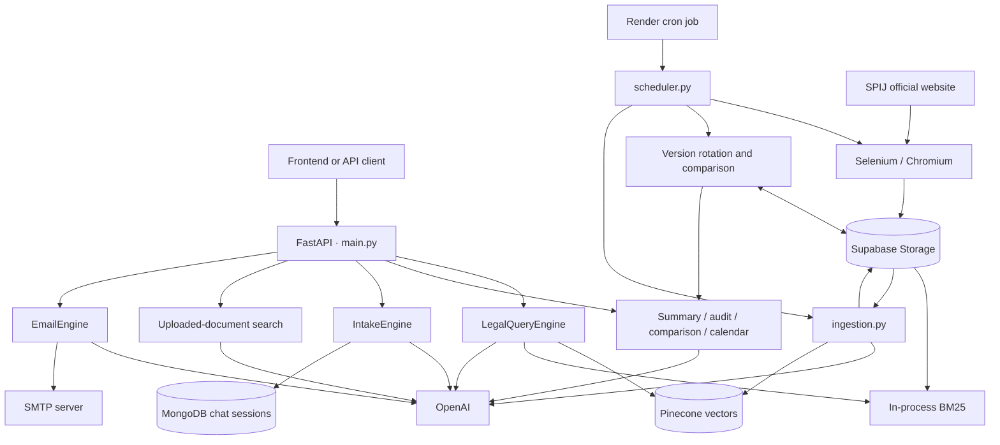
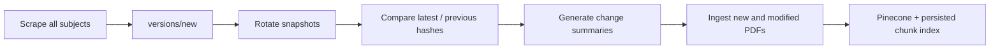
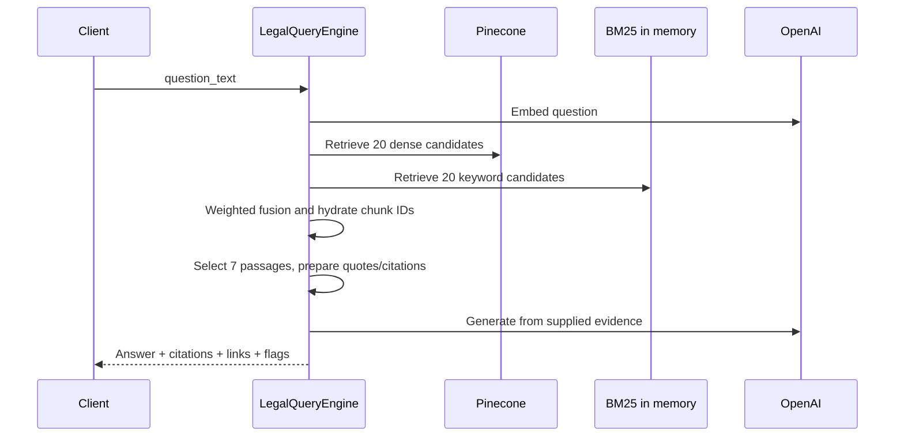

# LUKE — Legal Research & Document Intelligence

LUKE is a Python backend for Peruvian legal research and legal document workflows. It combines automated collection from Peru's SPIJ legal information system, versioned cloud document storage, hybrid retrieval-augmented generation (RAG), contract analysis, regulatory calendars, and persistent conversational intake behind a FastAPI API.

The engineering spans the full information lifecycle: discover official documents, download and fingerprint them, compare revisions, build searchable legal evidence, generate structured responses, and package results as PDF reports, calendar files, or client email drafts.

**Stack:** Python 3.11 · FastAPI · Selenium/Chromium · PyMuPDF/Tesseract · OpenAI · Pinecone · BM25 · Supabase Storage · MongoDB · ReportLab · Docker · Render


## Contents

- [Capabilities](#capabilities)
- [Architecture](#architecture)
- [Scraper and source collection](#scraper-and-source-collection)
- [Versioning and regulatory monitoring](#versioning-and-regulatory-monitoring)
- [Ingestion and legal chunking](#ingestion-and-legal-chunking)
- [RAG and retrieval](#rag-and-retrieval)
- [Document and communication workflows](#document-and-communication-workflows)
- [API reference](#api-reference)
- [Storage and data contracts](#storage-and-data-contracts)
- [Configuration](#configuration)
- [Local development](#local-development)
- [Docker and Render deployment](#docker-and-render-deployment)
- [Operations and troubleshooting](#operations-and-troubleshooting)
- [Repository map](#repository-map)

## Capabilities

| Workflow | Implementation | Primary output |
| --- | --- | --- |
| Legal research | Pinecone semantic retrieval + BM25 keyword retrieval + evidence-conditioned generation | Answer, article/page citations, source links, confidence flags |
| Document summary | PDF/DOCX extraction and LLM structured analysis | Executive summary, findings, parties/dates/amounts, PDF |
| Clause audit | User checklist compared with remotely stored clause baselines | Present/deviates/missing classifications, quotes, PDF |
| Version comparison | Line-level diff followed by legal impact analysis | Change log, impact levels, negotiation points, comparison PDF |
| Regulatory monitoring | Scheduled SPIJ scraping, SHA-256 manifests, version rotation and change summaries | Stored revision summaries and an alerts API |
| Regulatory calendar | Deadline extraction and recurrence conversion | Structured deadlines and Base64 ICS export |
| Client communication | Shared LLM email drafting and SMTP adapter | HTML email, optional report attachments, delivery status |
| Conversational intake | LLM routing and MongoDB-backed multi-turn sessions | Chat history and final work products |
| Uploaded-document search | Request-local embeddings and BM25 | Ranked passages, pages, snippets, relevance scores |

These are implemented workflow paths, not a claim that every acceptance criterion in the brief is enforced. See [implementation boundaries](#implementation-boundaries) for reproduction-relevant details.

## Architecture

The application has two execution roles: an HTTP API and a scheduled batch pipeline. They share cloud storage and the vector index; chat state lives in MongoDB.



FastAPI initializes `LegalQueryEngine`, `EmailEngine`, and `IntakeEngine` at module import. Its lifespan also creates a separate MongoDB client and closes that client at shutdown. This means importing `main.py` is not an offline operation: initialization accesses external services, including MongoDB indexes and the Pinecone index.

Most workflow endpoints return their result in the same HTTP request. Several synchronous SDK, parsing, and generation calls run inside async endpoints. There is no implemented job-ID/polling/webhook framework for those requests.

## Scraper and source collection

Source: [documents_scraper.py](documents_scraper.py).

### Source catalog

`URLS_BY_SUBJECT` defines **26 SPIJ starting URLs**. Seventeen entries are designated direct-document subjects in `CONSTITUTIONAL_DIRECT_URLS`; nine are subject collections.

| Group | Configured coverage |
| --- | --- |
| Direct documents | Political Constitution; Regulations of Congress; New Code of Constitutional Procedure; Civil Code; TUO Code of Civil Procedure; Criminal Code; Criminal Procedure Code; New Code of Criminal Procedure; Criminal Enforcement Code; Military Police Penal Code; Code of Military Police Justice; Code for Children and Adolescents; Code of Criminal Responsibility for Adolescents; Commercial Code; Consumer Protection and Defense Code; Tax Code (TUO); Code of Criminal Procedures |
| Subject collections | Anti-corruption; Anti-terrorism; Commercial; Constitutional; State Contracts and Acquisitions; Free Competition; Consumer Protection; Registry; Taxation |

“Constitutional Document” is the code's grouping label for direct documents, including several non-constitutional codes. The catalog is a configured starting set, not a guarantee of exhaustive Peruvian legal coverage.

### Collection process

1. `scrape_by_subject()` asks `gpt-3.5-turbo` to map a natural-language subject to an entry in the catalog. It validates exact matches and then tries substring matching against the returned text.
2. `SPIJScraper` creates a temporary download directory and launches Chrome/Chromium with headless download support through the Chrome DevTools Protocol.
3. It opens SPIJ's legislation interface, handles the entry button and legislation-by-subject navigation, then visits the selected start URL.
4. A breadth-first queue follows normalized internal links up to the requested depth. Visited URLs and queued URLs are checked to reduce repeated crawling.
5. Download icons open the website's export dialog. Multiple selectors are tried to select PDF and press the download button. The scraper waits for a PDF to appear, accounting for Chrome's temporary downloads.
6. Each downloaded file receives a SHA-256 fingerprint and is uploaded to `versions/new/<subject>/<filename>` in Supabase with upsert enabled. Local downloaded files are removed afterward.
7. The scraper uploads a subject-level `hashes.json` manifest and writes crawl statistics to `spij_results.json`, both locally and under `<subject>/spij_results.json` remotely.
8. The browser and temporary directory are cleaned up. The driver also restarts after 40 visited pages to limit long-running browser accumulation.

The weekly pipeline uses depth **0** for direct-document entries and **1** for the other subjects. Direct PDF links discovered in page anchors are recorded as internal/external URL inventories; the actual download path uses the website's export icons/dialogs.

### Browser selection and crawl limits

When `RENDER` or `RENDER_INTERNAL_HOSTNAME` is set, the scraper uses `/usr/bin/chromium` and `/usr/bin/chromedriver`. Otherwise it invokes `webdriver-manager`. Container examples below explicitly select the system-binary branch.

Each page processes at most the first **10** detected download icons. Successful download identifiers are based on the page URL, so multiple exports on the same page can be treated as duplicates. These details matter when assessing collection completeness.

## Versioning and regulatory monitoring

Sources: [scheduler.py](scheduler.py), [run_scheduler.py](run_scheduler.py), [versioning.py](versioning.py).



`run_weekly_scrape_cycle()` processes subjects sequentially and dispatches blocking stages through `run_in_executor()`. Individual subject failures are logged and the remaining subjects continue.

### Snapshot rotation

For each subject present in staging, `manage_version_rotation("versions/new")`:

1. Removes objects from that subject's old `versions/previous` folder.
2. Downloads the current `versions/latest` objects and uploads copies into `versions/previous`.
3. Downloads staging objects and uploads them into `versions/latest`.
4. Cleans staging objects in batches of 100 after the subject loop.

This is application-managed object copying, not a filesystem symlink switch or atomic snapshot transaction. File enumeration in rotation uses 100-item pagination. Existing latest objects absent from staging are not explicitly cleared, and caught subject failures do not prevent the later staging cleanup.

### Change detection

`process_regulatory_changes()` compares per-file manifest hashes across latest and previous:

- **New file:** generates a short addition message.
- **Changed hash:** downloads both PDFs and invokes `VersionCompareEngine` to explain changes.
- **Deleted file:** writes a removal message when a previous manifest entry is absent from the latest manifest.
- **Unchanged hash:** skips comparison.

Summaries are uploaded to `versions/changes/<subject>/<filename>.txt`. Deleted filenames receive an additional `_deleted` suffix before `.txt`. Entire subjects missing from latest are logged and skipped. Stored summaries are overwritten by filename rather than retained as a complete event history.

The `/regulatory-alerts` route separately maps a watchlist to subjects using `gpt-4-turbo`, reads change summaries, and asks the model for client-specific impact and action items. **The checked-in route reads local `regulatory_changes/`, while the batch pipeline writes remote `versions/changes/`; no synchronization adapter is included.**

### Scheduling modes

| Mode | Entry point | Schedule |
| --- | --- | --- |
| Render cron | `python run_scheduler.py` | `0 2 * * 6`: Saturday 02:00 UTC, as declared in `render.yaml` |
| Standalone APScheduler | `python scheduler.py` | Saturday 02:00 in `Asia/Karachi` |
| Manual complete cycle | `python run_scheduler.py` | One immediate cycle, then exit |

The two schedules differ by five hours. The Render container uses the one-shot entry point; the API does not start APScheduler. Running both scheduler modes would create two independent schedules.

## Ingestion and legal chunking

Sources: [ingestion.py](ingestion.py), [core/components.py](core/components.py).

### Incremental ingestion

1. Discover subject folders in Supabase `versions/latest`.
2. Load `indexes/processed_files_log.json` and `indexes/local_index.json`.
3. Read each subject's `hashes.json` and compare each hash with the processed-log key `<subject>/<filename>`.
4. Download only new or changed PDFs.
5. Use a `multiprocessing.Pool(cpu_count())` to extract text and build chunks from PDFs in parallel.
6. Embed chunk text in batches of **32** using OpenAI `text-embedding-3-small`.
7. Upsert vectors into Pinecone in batches of **100**.
8. Merge serialized chunks by deterministic chunk ID, retaining embeddings in the JSON index.
9. Upload the updated chunk index and processed-file log to Supabase.

This separates expensive document processing from interactive research and skips unchanged documents during normal repeat runs. The hash log is updated optimistically before successful processing, and ingestion merges/upserts without deleting obsolete chunks; see the operational implications below.

### Structure-aware chunks

`EnhancedLegalChunker` uses Spanish legal-text regular expressions to identify document types/numbers, a likely title, a date, chapters, article headings, references to laws, and cross-references to articles.

It creates an article chunk for each detected `Artículo <number>` heading. Explicit modification notes matching `(*) Artículo modificado por ...` are separated from the main text; quoted replacement text following `cuyo texto es el siguiente` becomes a `structural_modification` chunk.

Chunk IDs are MD5 hashes of:

```text
<pdf_name>_p<page_number>_art<article_number>_s<sub_index>
```

The hash provides a repeatable identifier; it is separate from the SHA-256 content fingerprint used for change detection.

Each `LegalChunk` carries source filename/path, page number, text, chunk type, document metadata, chapter/article information, legal and cross-references, parent context, character/word counts, and optional embedding information.

Although constructor defaults specify `chunk_size=1000` and `chunk_overlap=200`, the active chunk creation path does not implement fixed-size overlapping windows or a generic semantic fallback. It processes each PDF page independently. Text without recognized article headings can produce no chunks, and articles spanning pages are not reconstructed. Corpus ingestion uses text extraction without OCR.

### Vector storage

`PineconeVectorStore` creates the index if missing with these code defaults:

| Setting | Value |
| --- | --- |
| Index name | `legal-docs-peru` |
| Deployment | Serverless, AWS `us-east-1` |
| Metric | Cosine |
| Dimension | 1536 |
| Namespace | Default; no explicit namespace supplied |
| Persisted vector metadata | Text, PDF name, page number, document title/type, article number |

The richer chunk record lives in Supabase JSON. Pinecone text metadata is truncated to 40,000 characters per chunk; this character cap is not a total metadata-byte validation step.

## RAG and retrieval

### Corpus legal research

Source: [core/engine.py](core/engine.py).



At initialization, the query engine loads `indexes/local_index.json` from Supabase and constructs BM25 from lowercased whitespace-split chunk text. The retriever also loads the index during its own initialization. BM25 is rebuilt from the in-memory chunks when hybrid search runs.

For each question:

1. Generate an embedding and request the top 20 Pinecone matches.
2. Run BM25 and retain up to 20 positive-score matches.
3. Normalize sparse scores by the highest returned BM25 score and combine candidate scores:

   ```text
   score(chunk) = 0.55 × dense_cosine_score
                + 0.45 × (BM25_score / maximum_returned_BM25_score)
   ```

   A missing dense or sparse contribution is zero.

4. Sort the union, retain 20 candidates, and resolve IDs against the loaded JSON chunks.
5. Select up to seven chunks. `HybridRetriever` supports Cohere reranking, but `LegalQueryEngine` does not pass the Cohere key, so its active path uses fused order.
6. Construct citations with source name/title, article/section, page, and a cleaned quote. Quotes are shortened to approximately 200 characters; these shortened excerpts also form the generation context.
7. Call `gpt-4-turbo` at temperature `0.1` with instructions to use only supplied evidence, recognize modifications, and acknowledge insufficient evidence.
8. Return `answer_text`, `citations`, `official_pdf_links`, and confidence flags.

No matches returns `no_relevant_documents_found`. A normal generated answer uses `answer_generated_from_indexed_sources`; these flags are status labels, not calibrated probabilities.

Source links are constructed from filenames into SPIJ detail routes. They are not resolved and verified as official downloadable PDFs. Citation validation checks quote presence/length; it does not verify every generated claim against its source. A deduplication helper exists but is not called by the answer path.

The Supabase chunk index is required to hydrate Pinecone hits. A missing JSON index is therefore more consequential than losing keyword retrieval: dense hits without corresponding loaded chunks do not become final evidence. Existing API processes do not automatically reload this JSON after ingestion.

### Uploaded-document search

Source: [core/knowledgesearch_engine.py](core/knowledgesearch_engine.py).

`InMemorySearchEngine` creates a fresh index for each request:

1. Read uploaded bytes as PDFs with PyMuPDF.
2. Apply the same legal article chunker.
3. Build BM25 and embed all extracted chunks.
4. Calculate cosine similarities with normalized NumPy vectors.
5. Retrieve up to `top_k × 3` candidates from each retrieval method.
6. Fuse scores using `0.6 × cosine + 0.4 × (BM25 / 10)` and return `top_k` results.

Results include `file`, `page`, `snippet`, `link_to_page`, and `confidence`. The score is a ranking value and can exceed 1. Links have the form `<filename>#page=<number>`; the frontend must provide an accessible document URL/viewer.

This path does not persist uploaded documents or vectors to Pinecone. It still initializes the shared retriever, which requires Supabase configuration and attempts to load its remote index. It passes a Cohere key but never calls reranking. Despite the route description mentioning DOCX, the active parser is PDF-only and does not use OCR.

### Model roles

| Task | Model selected by code |
| --- | --- |
| Embeddings | `text-embedding-3-small` |
| Research, analysis, audit, comparison, intake, email, deadline extraction | `config.GENERATION_MODEL`, hardcoded to `gpt-4-turbo` |
| Scraper subject matching | `gpt-3.5-turbo` |
| Watchlist-to-subject mapping | `gpt-4-turbo` |
| Calendar recurrence-to-RRULE conversion | `gpt-3.5-turbo` |
| Optional shared reranker | Cohere `rerank-multilingual-v2.0` |
| Shared embedding fallback | `sentence-transformers/paraphrase-multilingual-mpnet-base-v2` |

These are repository settings, not a statement about current provider availability. Switching embedding families also requires matching index dimensions and rebuilding indexed data; the fallback is not a drop-in replacement for the default 1536-dimensional index.

## Document and communication workflows

### Shared parsing and quality checks

[DocumentProcessor](core/document_processor.py) accepts an upload, PDF bytes, a local path, or a URL. PDF pages use native text extraction first, with Tesseract OCR on pages containing no extracted text. DOCX extraction includes paragraphs and table cells.

`process()` returns **`(full_text, quality_flags)`**. Average text density below 150 characters per page produces `low_ocr_confidence`; this is a heuristic, not Tesseract's measured recognition confidence. DOCX page count is approximated from text length. The flattened text does not preserve explicit page markers for downstream LLM analysis.

The Docker images install Tesseract, but the OCR call does not select a Spanish language pack. Uppercase extensions pass initial validation but are not normalized for the later case-sensitive parser dispatch.

### Executive summary

[AnalysisEngine](core/analysis_engine.py) requests an executive summary, topic-specific findings with quotes/pages, and structured parties, dates, deadlines, and monetary amounts. It validates findings with Pydantic and produces a Base64 ReportLab PDF.

The intended text cap is 100,000 characters. In the current code, the engine stores the processor's entire tuple as `self.full_text`, then slices and interpolates that tuple. Consequently the cap does not actually limit the document string, the prompt includes tuple formatting, and quality flags are not propagated into the response. This is a documented implementation mismatch rather than an enforced analysis limit.

### Clause audit

[ClauseAuditEngine](core/clauseaudit_engine.py) lowercases the supplied checklist, loads `baselines/clause_baselines.json` from Supabase, and falls back to that local path if needed. Neither baseline data file is included in this repository. If both lookups fail, it continues with an empty baseline dictionary.

The model receives up to 80,000 document characters, baseline data, and the checklist. It infers document type and classifies requested clauses as `PRESENT`, `DEVIATES`, or `MISSING`, with supporting summaries and quotes. JSON parsing includes a `json-repair` fallback, normalization, and Pydantic validation. A ReportLab table colors statuses green, orange, and red. Quality flags are returned in the API response.

### Smart version comparison

[VersionCompareEngine](core/versioncompare_engine.py) parses both files, merges quality flags, and uses `difflib.Differ` to group additions, deletions, and modifications. It retains surrounding context and filters change groups with at most 10 combined text characters.

The LLM receives up to 50 structural changes plus the first 80,000 characters of each version, with a 4,000-token output cap. Each result can contain a section, old/new wording, summary, impact explanation/level, category, negotiation points, and page references. Categories cover economics, risk, timing, scope, governance, compliance, and other. A comparison PDF contains summaries and change details.

This is a semantic change report, not an exported Word tracked-changes document. Model page references are not independently checked against a retained page map. An LLM failure returns an empty change list, which must not be interpreted as independently verified equivalence.

### Regulatory calendar

[RegulatoryCalendarEngine](core/regulatorycalender_engine.py) extracts deadlines from up to 80,000 characters with today's date as context. Responses distinguish absolute/recurring events from relative obligations whose trigger date is unknown.

Only `is_plannable=true` items are considered for ICS export. Absolute dates become all-day events. Recurrence dictionaries are translated into RRULE strings by a second LLM call and added through the `ics` library. Invalid dates are skipped; no exportable events produces an empty Base64 string. Relative obligations remain visible in the structured response.

Recurring start-date selection uses a month/day candidate and an annual rollover; weekly/monthly recurrence should be checked in demonstrations rather than assumed fully resolved by that date-selection logic.

### Email drafting and delivery

[EmailEngine](core/emailengine.py) serializes a workflow result without its large PDF/ICS fields and asks the model for a subject and HTML body. Sending uses `smtplib.SMTP`, STARTTLS, login, and MIME attachments.

Research, summary, audit, comparison, alerts, calendar, and uploaded search expose:

| Query parameter | Default | Purpose |
| --- | --- | --- |
| `draft_email` | `false` | Generate an email draft |
| `send_email` | `false` | Request SMTP delivery |
| `lawyer_approved` | `true` | Caller-supplied approval flag |
| `recipient_email` | Unset | Destination required for sending |

Drafting alone does not send email. Successful delivery returns `sent`; SMTP failure returns `failed`; a send request without approval generally returns `pending_approval`. Uploaded search explicitly rejects a send request without a recipient. Other flows generally mark it pending. Chat endpoints support draft generation on completion, without a send option.

Summary/audit/comparison emails attach their PDF; calendar emails attach `Deadlines.ics`. This implementation uses SMTP only, with no separate Microsoft 365 or Gmail OAuth adapter. The approval default is `true`, unlike the brief's requested approval-required-by-default behavior; the flag is not an authenticated approval record.

### Conversational intake

[IntakeEngine](core/intakeengine.py) stores sessions in MongoDB `luke_api.chat_sessions`, with an index on `user_email` and a unique index on `session_id`.

Starting a chat always inserts a new UUID session. Each turn loads history and classifies the new message using an LLM:

- Legal-research messages are routed to `LegalQueryEngine`; answers, citations, links, and flags are rendered into assistant text.
- Other messages use an intake prompt that asks one question at a time. Uploaded PDFs contribute at most 5,000 extracted characters each to the conversation.
- `[AWAITING_DOCUMENT]` sets `awaiting_document`; `[READY_TO_FINALIZE]` sets `complete` and triggers JSON work-product generation. Otherwise the state remains `in_progress`.

User/assistant history and timestamps are updated in MongoDB. Session history can be listed, fetched, or deleted. Final work products are returned to the caller but are not separately persisted in the session record.

The research branch passes an extra `file` argument to `LegalQuestionRequest`, whose schema has no file field; uploaded content is therefore not incorporated into corpus research. The final-product calendar helper also calls an instance method without an instance and records an `ics_generation_error` if that path runs.

## API reference

FastAPI metadata: **LUKE - Legal Research API**, version **1.0.0**. Interactive docs are available at `/docs`, ReDoc at `/redoc`, and the schema at `/openapi.json` when the configured application starts.

| Method | Path | Input | Response / behavior |
| --- | --- | --- | --- |
| GET | `/` | None | Basic message and legacy local symlink status |
| POST | `/trigger-scraper` | None | Proxies to configured scheduler URL's `/run` |
| POST | `/answer` | JSON `question_text`, optional `context_tags` | `AnswerResponse` |
| POST | `/analyze-document` | Multipart `file`, optional repeated `topics` | `DocumentSummaryResponse` |
| POST | `/audit-clauses` | Multipart `file`, repeated `checklist` | `ClauseAuditResponse` |
| POST | `/compare-versions` | Multipart `file_v1`, `file_v2`, optional repeated `topic_focus` | `VersionCompareResponse` |
| POST | `/regulatory-alerts` | JSON `watchlist`, optional `client_profiles` | `RegulatoryAlertsResponse` |
| POST | `/extract-deadlines` | Multipart `file` | `RegulatoryCalendarResponse` |
| POST | `/chat/start` | `user-email` header; multipart `goal`, `initial_message`, optional `files` | `ChatTurnResponse` |
| POST | `/chat/turn/{session_id}` | Multipart `new_message`, optional `files` | `ChatTurnResponse` |
| GET | `/chats/history` | `user-email` header | List of session summaries |
| GET | `/chats/session/{session_id}` | `user-email` header | Full session record |
| DELETE | `/chats/{session_id}` | `user-email` header | Deletion confirmation |
| POST | `/search-uploaded-documents` | Multipart `query`, repeated `files`, optional `top_k` | `SearchResponse` |

`question_text` has a 10-character minimum. Search `top_k` defaults to 5 and is constrained to 1–20. Intake goals are `new_matter_intake` and `policy_review`. FastAPI converts the Python header name `user_email` to the HTTP header `user-email`. `context_tags` is accepted but not used for retrieval filtering.

### Request examples

These examples use Bash-style quoting and line continuation. On Windows, use the interactive docs or adapt the commands to PowerShell (`curl.exe` avoids the Windows PowerShell alias).

```bash
curl http://localhost:10000/answer \
  -H 'Content-Type: application/json' \
  -d '{"question_text":"What does the indexed legislation say about consumer protection?","context_tags":["consumer"]}'

curl http://localhost:10000/analyze-document \
  -F 'file=@contract.pdf' -F 'topics=termination' -F 'topics=payment'

curl http://localhost:10000/audit-clauses \
  -F 'file=@contract.pdf' -F 'checklist=confidentiality' -F 'checklist=termination'

curl http://localhost:10000/compare-versions \
  -F 'file_v1=@contract-v1.pdf' -F 'file_v2=@contract-v2.pdf' -F 'topic_focus=risk'

curl http://localhost:10000/regulatory-alerts \
  -H 'Content-Type: application/json' \
  -d '{"watchlist":["taxation"],"client_profiles":["retail business"]}'

curl http://localhost:10000/extract-deadlines -F 'file=@contract.pdf'

curl http://localhost:10000/search-uploaded-documents \
  -F 'query=consumer obligations' -F 'files=@legal-code.pdf' -F 'top_k=5'

curl http://localhost:10000/chat/start \
  -H 'user-email: demo@example.com' \
  -F 'goal=new_matter_intake' -F 'initial_message=Help me organize a new client matter.'

curl http://localhost:10000/chat/turn/SESSION_ID \
  -F 'new_message=The client is preparing a supplier agreement.'

curl http://localhost:10000/chats/history -H 'user-email: demo@example.com'
curl http://localhost:10000/chats/session/SESSION_ID -H 'user-email: demo@example.com'
```

For a draft-only demonstration, append `?draft_email=true&send_email=false` to a supported workflow URL. The alert example requires addressing the storage mismatch documented above.

### Downloading returned artifacts

Generated documents are returned inside JSON rather than through download endpoints:

| Workflow | Base64 field | File format |
| --- | --- | --- |
| Summary / clause audit | `one_pager_pdf_base64` | PDF |
| Version comparison | `summary_pdf_base64` | PDF |
| Calendar | `ics_file_base64` | ICS |

For example, after saving a comparison response to `response.json`:

```python
import base64
import json
from pathlib import Path

response = json.loads(Path("response.json").read_text(encoding="utf-8"))
Path("comparison.pdf").write_bytes(base64.b64decode(response["summary_pdf_base64"]))
```

ReportLab can paginate content; fields named “one pager” do not enforce a single-page output.

## Storage and data contracts

### Supabase bucket layout

```text
<SUPABASE_BUCKET>/
├── versions/
│   ├── new/<subject>/<filename>.pdf
│   ├── new/<subject>/hashes.json
│   ├── latest/<subject>/<filename>.pdf
│   ├── latest/<subject>/hashes.json
│   ├── previous/<subject>/<filename>.pdf
│   ├── previous/<subject>/hashes.json
│   └── changes/<subject>/<filename>.txt
├── indexes/
│   ├── local_index.json
│   └── processed_files_log.json
├── baselines/
│   └── clause_baselines.json
└── <subject>/spij_results.json
```

`versions/new` is staging and is cleaned by rotation. Despite its name, `local_index.json` is cloud-persisted and downloaded into process memory; it contains serialized chunks and embeddings rather than a serialized BM25 object.

Illustrative manifest structure:

```json
{
  "metadata": {
    "generated_at": "2026-01-01T00:00:00",
    "total_files": 1,
    "subject": "Taxation"
  },
  "files": {
    "example.pdf": {"hash": "<sha256-of-pdf-bytes>"}
  }
}
```

`processed_files_log.json` maps `<subject>/<filename>` to a hash. `local_index.json` contains `chunks` and a `timestamp`.

### MongoDB

The active chat collection is **`luke_api.chat_sessions`**, with these fields:

```text
_id, session_id, user_email, goal,
history[{role, content}], created_at, last_updated
```

`main.py` also opens database `LUKE` on its lifespan client, but chat operations use the separate client/database owned by `IntakeEngine`. The local `chat_sessions/` directory is created at import but is not the active chat persistence store.

### Data movement

Official PDFs and derived indexes go to Supabase; vectors and selected metadata go to Pinecone. Uploaded document text is sent to OpenAI for supported analysis workflows, and embeddings require sending chunk text to OpenAI. Intake upload excerpts become part of persisted MongoDB history. Uploaded-search vectors remain in request memory. SMTP delivery sends the generated email and applicable artifacts to the selected recipient.

## Configuration

Create a private `.env` in the repository root for local use. Replace the following placeholders with values for your environment:

```dotenv
OPENAI_API_KEY=replace-me
PINECONE_API_KEY=replace-me
SUPABASE_URL=https://your-project.supabase.co
SUPABASE_KEY=replace-me
SUPABASE_BUCKET=your-bucket
MONGO_DB_CONNECTION_STRING=mongodb://localhost:27017

# Optional provider support in the shared retriever
COHERE_API_KEY=

# Optional SMTP delivery
EMAIL_SENDER_ADDRESS=
EMAIL_SENDER_PASSWORD=
SMTP_SERVER_HOST=
SMTP_SERVER_PORT=587

# Optional external HTTP scheduler bridge; not supplied by the cron container
SCHEDULER_URL=
SCHEDULER_SECRET=
```

| Variable | Requirement / use |
| --- | --- |
| `OPENAI_API_KEY` | API generation, embeddings, subject matching, batch comparison |
| `PINECONE_API_KEY` | Corpus vector index creation/query/upsert |
| `SUPABASE_URL`, `SUPABASE_KEY`, `SUPABASE_BUCKET` | Required by storage clients; provision bucket separately with appropriate object access |
| `MONGO_DB_CONNECTION_STRING` | Required for API intake initialization and MongoDB index creation |
| `COHERE_API_KEY` | Optional shared reranking client; not activated in corpus research wiring |
| SMTP variables | Required for actual sending, not for draft generation |
| `SCHEDULER_URL`, `SCHEDULER_SECRET` | Used by `/trigger-scraper` to contact an external HTTP service |
| `RENDER` / `RENDER_INTERNAL_HOSTNAME` | Select installed Linux browser paths |
| `PYTHONUNBUFFERED` | Immediate Python log output in containers |
| `RUN_MODE` | Declared in Render configuration, but no application branch reads it |
| `GENERATION_MODEL` | Declared in Render configuration, but `config.py` assigns a literal model name instead of reading this environment variable |

Other code constants include `USE_OPENAI_EMBEDDINGS=True`, `HYBRID_SEARCH_ALPHA=0.55`, and `CLAUSE_BASELINES_PATH="baselines/clause_baselines.json"`. `PDF_FOLDER_PATH="pdfs_check"` and `LOCAL_INDEX_PATH="local_bm25_index.json"` are legacy settings; active corpus ingestion and retrieval use Supabase. Embedding/reranker model names are also repeated as literals in the shared component.

## Local development

### Prerequisites

- Python 3.11, or Docker for the supplied Linux images.
- OpenAI, Pinecone, and Supabase credentials; a pre-created Supabase bucket.
- A reachable MongoDB instance for the API.
- Chrome/Chromium and a compatible driver for scraping.
- Tesseract for OCR. Windows parsing config points to `C:\Program Files\Tesseract-OCR\tesseract.exe`.
- Baseline JSON in Supabase or the configured local path for baseline-backed audits.

### Install and start

```bash
python -m venv .venv
```

Activate the virtual environment:

```powershell
# PowerShell
.\.venv\Scripts\Activate.ps1
```

```bash
# Bash
source .venv/bin/activate
```

Then install and launch:

```bash
python -m pip install -r requirements.txt
python -m uvicorn main:app --host 0.0.0.0 --port 10000
```

Open `http://localhost:10000/docs`. An empty deployment needs a corpus bootstrap before research can produce evidence.

### Populate or refresh the corpus

The complete cycle contacts SPIJ and model services and updates cloud snapshots/indexes:

```bash
python run_scheduler.py
```

To ingest an already populated `versions/latest` without scraping or rotation:

```bash
python ingestion.py
```

To collect one subject into staging only:

```bash
python -c "from documents_scraper import scrape_by_subject; scrape_by_subject('Taxation', max_depth=1, headless=True)"
```

`python documents_scraper.py` runs the single Political Constitution example; it does not run the full weekly pipeline. Restart the API after ingestion to reload the cloud chunk index into memory.

## Docker and Render deployment

### Image definitions

| Detail | API image | Scheduler image |
| --- | --- | --- |
| File | [Dockerfile](Dockerfile) | [Dockerfile.scheduler](Dockerfile.scheduler) |
| Base | `python:3.11-slim` | `python:3.11-slim` |
| OS packages | Chromium, chromedriver, Tesseract, libtesseract-dev, fonts-liberation | Chromium, chromedriver, Tesseract, libtesseract-dev |
| Working directory | `/app` | `/app` |
| Source copy | `COPY . .` | `COPY . .` |
| Dependencies | `pip install --no-cache-dir -r requirements.txt` | Same |
| Command | `uvicorn main:app --host 0.0.0.0 --port 10000` | `python run_scheduler.py` |
| Listening port | `10000` | None; batch process |

There is no checked-in Docker Compose file, `.dockerignore`, healthcheck, or persistent-volume declaration. Both images install the full dependency set, including Torch and sentence-transformers even with OpenAI embeddings selected. Because all source is copied before dependency installation, source changes invalidate that install layer.

### Keep local secrets out of image builds

The current `COPY . .` includes everything in the build context. Before building from a directory containing `.env`, create a `.dockerignore` such as:

```text
.env
.env.*
!.env.example
.git
.venv
__pycache__
**/__pycache__
*.pyc
chat_sessions
spij_results.json
```

This is a suggested local build preparation step, not an existing repository file. Inject credentials at runtime with `--env-file` or the hosting platform's secret configuration.

### Build and run

```bash
docker build -t luke-api:local -f Dockerfile .
docker build -t luke-scheduler:local -f Dockerfile.scheduler .

docker run --rm --name luke-api --env-file .env -e PYTHONUNBUFFERED=1 -p 10000:10000 luke-api:local
```

In another terminal, run a single batch cycle when a corpus refresh is intended:

```bash
docker run --rm --name luke-scheduler --env-file .env -e RENDER=true -e PYTHONUNBUFFERED=1 luke-scheduler:local
```

`RENDER=true` selects the installed Chromium/chromedriver paths even outside Render. A host-local MongoDB URI using `localhost` will point inside the container; use a reachable service address, or `host.docker.internal` for a host service on Docker Desktop.

The API process binds to a fixed port 10000; it does not read a dynamic `PORT` environment variable. Cloud data is stored externally, so no shared filesystem volume is configured between API and scheduler.

### Render blueprint

[render.yaml](render.yaml) declares:

| Service | Type | Dockerfile | Configuration |
| --- | --- | --- | --- |
| `luke-api` | Web | `./Dockerfile` | Standard plan declaration, automatic deploys, runtime secrets |
| `luke-scheduler-job` | Cron | `./Dockerfile.scheduler` | Standard plan declaration, automatic deploys, Saturday 02:00 UTC |

Deployment sequence based on this manifest:

1. Provision Supabase Storage, a reachable MongoDB database, and provider credentials.
2. Connect the repository as a Render Blueprint using `render.yaml`.
3. Populate variables marked `sync: false` for each service. Use the same storage bucket and Pinecone configuration for both roles.
4. Supply clause baselines in the configured storage path.
5. Build the services and run one complete scheduler cycle to bootstrap the corpus.
6. Restart/redeploy the API after the index has been written so its in-memory chunks match the newly ingested corpus.
7. Exercise the API docs with known source documents and inspect service logs.

The manifest records the intended hosting configuration; no live deployment was inspected for this README. Provider plan availability and successful image builds are not established by the manifest alone.

### Manual scraper endpoint

`POST /trigger-scraper` sends a request to `${SCHEDULER_URL}/run` with `{"secret": SCHEDULER_SECRET}` and a 10-second timeout. **No `/run` server is implemented in this repository.** The Render cron container executes a script and exits, so it cannot serve that URL. Use the one-shot entry point for the included deployment, or implement and configure an external HTTP bridge before relying on this endpoint.

## Operations and troubleshooting

### What to verify after a refresh

- Subject manifests contain the expected filenames and counts.
- Latest and previous snapshots correspond to the intended runs.
- `indexes/local_index.json` has chunks and a recent timestamp; the processed log matches successful ingestion.
- Pinecone contains matching IDs, and the restarted API has loaded the corresponding JSON chunks.
- A research query retrieves a known article and the returned excerpt is checked against the actual source PDF.
- Generated PDF/ICS outputs decode and open successfully; draft-only email output contains the expected source details.

The root route is a basic liveness response with legacy local-symlink checks. Its “scheduler is running” message does not establish scheduler health, and `Not set` symlink values do not diagnose the cloud snapshots.

| Symptom | Implementation-specific explanation |
| --- | --- |
| API fails during import/startup | Required provider/storage configuration missing; MongoDB unavailable during intake index creation; external index setup failed |
| Research returns no evidence despite Pinecone vectors | Missing/stale Supabase chunk JSON prevents hydration of retrieved IDs |
| A document produces no searchable passages | Article regex does not match, or PDF contains only images; corpus/search ingestion has no OCR fallback |
| New corpus data is not reflected in answers | API retains its previously loaded chunk index; restart after ingestion |
| Alerts are empty after the scheduler reports changes | API reads local `regulatory_changes/`; batch writer uses Supabase `versions/changes/` |
| Manual trigger fails | External `/run` service or scheduler environment variables are absent |
| Browser bootstrap fails in local Docker | Without the Render flag, the code selects webdriver-manager instead of the installed binaries |
| Changed/deleted content remains searchable | Upserts and JSON merges do not remove obsolete chunk IDs |
| A failed PDF is skipped on the next ingestion | Processed hashes are recorded before successful download/chunking and can be persisted optimistically |
| Summary quality flag missing or prompt unexpectedly large | `AnalysisEngine` does not unpack the processor tuple |
| Email draft works but sending fails | SMTP settings, connectivity, STARTTLS/login, or provider delivery configuration need checking |

Logging is primarily `print()` and tracebacks, exposed through container stdout/stderr. There is no dedicated metrics dashboard, tracing configuration, benchmark suite, or automated test suite in the repository. Several functions catch errors and return empty data; the top-level scheduler also catches failures without re-raising, so successful process exit alone is not evidence that every stage succeeded.


## Repository map

```text
.
├── main.py                         # FastAPI routes, shared engines, lifecycle, email integration
├── config.py                       # Secrets loading, model/index constants, metadata
├── documents_scraper.py            # SPIJ browser crawler, subject catalog, hashes and uploads
├── versioning.py                   # Cloud snapshot rotation and change detection
├── ingestion.py                    # Incremental PDF chunking, embeddings, vector/index persistence
├── scheduler.py                    # Weekly pipeline and standalone APScheduler mode
├── run_scheduler.py                # One-shot cron entry point
├── Dockerfile                      # API container
├── Dockerfile.scheduler            # Batch container
├── render.yaml                     # Render web + cron blueprint
├── requirements.txt                # Python dependency snapshot
└── core/
    ├── __init__.py
    ├── components.py               # LegalChunk, legal chunker, vector store, hybrid retriever
    ├── engine.py                   # Corpus legal research and citation formatting
    ├── document_processor.py       # Shared PDF/DOCX extraction and OCR
    ├── analysis_engine.py          # Executive summaries and PDF reports
    ├── clauseaudit_engine.py       # Baseline-driven clause audit
    ├── versioncompare_engine.py    # Structural diff and legal impact report
    ├── regulatorycalender_engine.py # Deadline extraction and ICS generation
    ├── emailengine.py              # HTML drafting and SMTP delivery
    ├── intakeengine.py             # MongoDB sessions and conversational routing
    ├── knowledgesearch_engine.py    # Uploaded-PDF in-memory hybrid search
    └── schemas.py                  # Pydantic API contracts
```

The dependency file includes the primary libraries plus transitive and optional packages. Examples of pinned application dependencies are FastAPI `0.118.2`, Uvicorn `0.37.0`, OpenAI `2.2.0`, Pinecone `7.3.0`, Supabase `2.22.0`, Selenium `4.36.0`, PyMuPDF `1.26.4`, and PyMongo `4.15.3`. This records the repository's dependency declarations, not a fresh compatibility certification.

--
